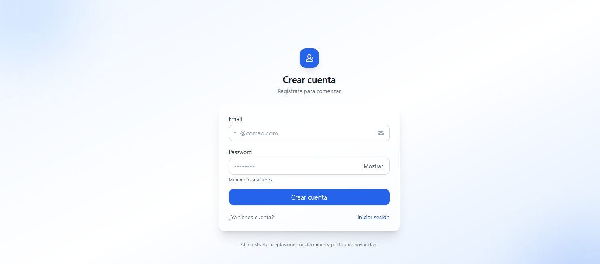
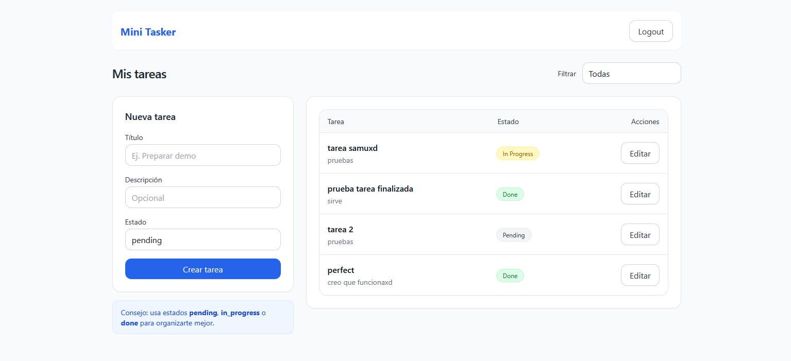

# ✅ Requisitos previos

Docker Desktop (Win/Mac/Linux)

Node.js 18+ y npm (para el frontend local)

Puertos libres: 8080 (API), 5174 (Vite), 3307 (MySQL host)

# 📘 Mini Tasker

Aplicación full-stack (Phalcon PHP + MySQL + React/Redux) para gestionar tareas:

- Registro / Login (JWT)
- Listar / filtrar tareas
- Crear / editar tareas
- Frontend con Vite + Tailwind

---

## 🚀 Stack

- **Backend**: Phalcon PHP (Micro), Nginx, PHP-FPM, MySQL 8
- **Frontend**: React + Redux Toolkit + Vite + TailwindCSS
- **Infra**: Docker Compose

---

## 🐳 Levantar el proyecto

### Arrancar contenedor
docker compose up -d --build

### 1. Variables frontend
Crear `frontend/.env`:

VITE_API_URL=http://localhost:8080

2. Docker up

docker compose up -d --build

    Backend (API) → http://localhost:8080

Frontend (Vite) → http://localhost:5174

    MySQL → expuesto en localhost:3307
## 🧱 Migraciones (SQL)

Los scripts SQL están en `backend/db/` y **se ejecutan en orden alfabético**:

backend/db/
├─ 001_users.sql
└─ 002_tasks.sql

### Ejecutar migraciones manualmente

**Linux / Git Bash**

docker exec -i mysql_db mysql -u root -proot tasks_db < backend/db/001_users.sql

docker exec -i mysql_db mysql -u root -proot tasks_db < backend/db/002_tasks.sql

Windows PowerShell

type .\backend\db\001_users.sql | docker exec -i mysql_db mysql -u root -proot tasks_db

type .\backend\db\002_tasks.sql | docker exec -i mysql_db mysql -u root -proot tasks_db

Verificar que las tablas se crearon

docker exec -it mysql_db mysql -u root -proot -e "USE tasks_db; SHOW TABLES;"

    Si quieres aplicar todas las migraciones automáticamente, mapea ./backend/db en el docker-compose.yml a /docker-entrypoint-initdb.d y recrea el contenedor de MySQL.

B) Inicialización automática

En docker-compose.yml, mapear SQL:

volumes:
  - db_data:/var/lib/mysql
  - ./backend/db:/docker-entrypoint-initdb.d

Luego:

docker compose down -v
docker compose up -d --build

🔐 Endpoints principales

    POST /api/register → registrar usuario

    POST /api/login → retorna { token }

    GET /api/tasks → listar tareas (requiere Authorization: Bearer <token>)

    POST /api/tasks → crear tarea

    PUT /api/tasks/{id} → actualizar tarea

Ejemplos con curl

# Registro
curl -X POST http://localhost:8080/api/register \
  -H "Content-Type: application/json" \
  -d '{"email":"demo@example.com","password":"secret123"}'

# Login
TOKEN=$(curl -s -X POST http://localhost:8080/api/login \
  -H "Content-Type: application/json" \
  -d '{"email":"demo@example.com","password":"secret123"}' | jq -r .token)

# Crear tarea
curl -X POST http://localhost:8080/api/tasks \
  -H "Authorization: Bearer $TOKEN" -H "Content-Type: application/json" \
  -d '{"title":"Primera tarea","description":"prueba","status":"pending"}'

🖥️ Frontend
Desarrollo

cd frontend

npm install

npm run dev

Abrir: http://localhost:5174

Configura .env con:

VITE_API_URL=http://localhost:8080

Proxy opcional en vite.config.js:

server: {
  port: 5174,
  proxy: {
    "/api": { target: "http://localhost:8080", changeOrigin: true },
  },
}

# Reiniciar el servicio 

docker compose restart app

🧰 Comandos útiles

Logs

docker logs -f nginx_server

docker logs -f phalcon_app

docker logs -f mysql_db

Entrar a contenedor

docker exec -it phalcon_app sh

docker exec -it mysql_db bash

Resetear

docker compose down -v

docker compose up -d --build

docker compose restart app

## 📸 Screenshots

### Login

### Vista de Tareas

# ⚡️Quickstart
# 1) Levantar stack
docker compose up -d --build

# 2) Aplicar migraciones (Git Bash / Linux)
docker exec -i mysql_db mysql -u root -proot tasks_db < backend/db/001_users.sql

docker exec -i mysql_db mysql -u root -proot tasks_db < backend/db/002_tasks.sql

2b) PowerShell (Windows)
type .\backend\db\001_users.sql | docker exec -i mysql_db mysql -u root -proot tasks_db

type .\backend\db\002_tasks.sql | docker exec -i mysql_db mysql -u root -proot tasks_db

 # 3) Verificar tablas
docker exec -it mysql_db mysql -u root -proot -e "USE tasks_db; SHOW TABLES;"
Debe mostrar: users, tasks

#4) Frontend
cd frontend
npm install
npm run dev
abrir http://localhost:5174

